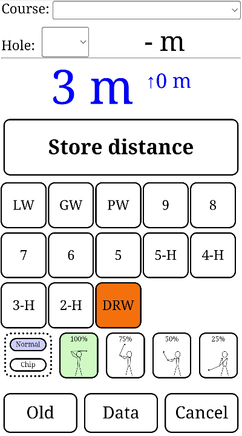
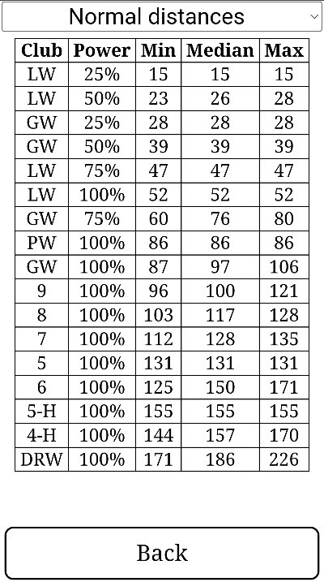
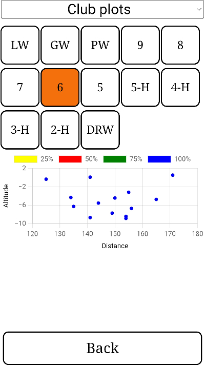
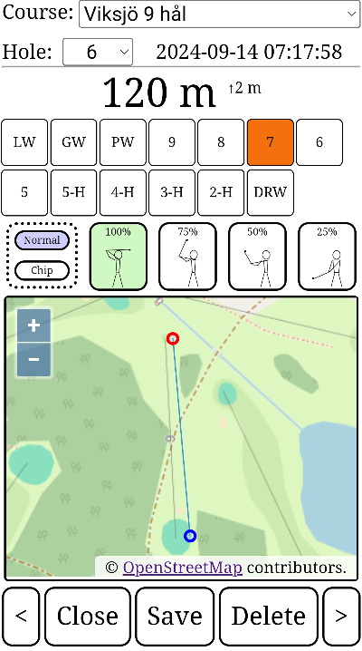

# Golf Distance

Measure distance of your golf strokes using GPS positioning. 

## Fetures

Measure distance of specific club and power (100%, 75%, 50% or 25%). You can also select course and hole for the specific stroke.

Display min, median and max distance for each club and power based on historical strokes.

Plot all strokes for a specific club using altitude on y-axis and distance on x-axis.

Display storke history with a map illustrating stroke position and end ball position.

Other features:

* Display distance to center of green for selected course and hole (if you have registred GPS position for the course holes).
* Add new courses.
* Select clubs you have in your bag.
* Export and import data to and from CSV format.

## Installation

This application requires waserver to run. Install waserver, and run application from there.

**Note!** This application utilizes the javascript Geolocation API. All new WEB browsers requires the server to run over TLS/HTTPS, thus you need to run waserver with "-s" parameter enabled.